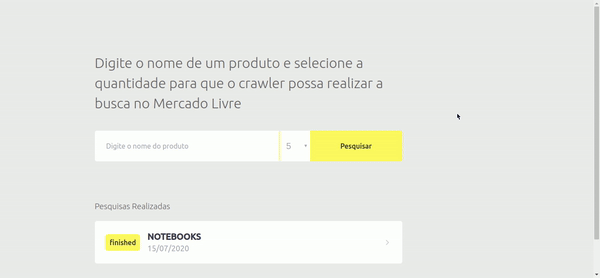
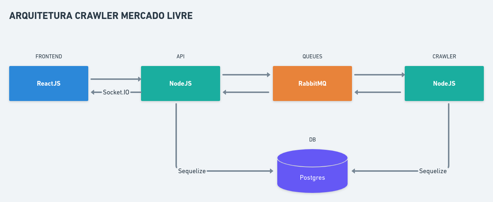

# Crawler Mercado Livre
Crawler que busca lista de produtos no Mercado Livre utilizando NodeJS (backend), RabbitMQ (mensageria), SocketIO (websocket) e ReactJS (frontend).




## Arquitetura


## Rodando a aplicação
Antes de rodar a aplicação é necessário ter instalado:

* nodeJS
* yarn
* postgres
* rabbitmq

Para a instalação do postgres e do rabbitmq foi utilizado o docker. Abaixo segue os comandos utilizados:

```sh
$ docker run -d --name postgres_docker -e POSTGRES_PASSWORD=docker -p 5432:5432 postgres
```

```sh
$ docker run -d --name rabbitmq_docker -p 15672:15672 -p 5672:5672 -p 25676:25676 rabbitmq:3-management
```

Além disso, é necessário rodar o comando abaixo em todos os 3 projetos pertencentes a esta aplicação para que as dependências sejam instaladas.

```sh
$ yarn install
```

## Criando a base de dados
Para salvar os dados foi utilizado o Postgres como banco de dados relacional e o Sequelize como ORM (*Object-Relational Mapping*). Para criar o banco de dados e tabelas, dentro do diretório da API, rode os comandos abaixo:

```sh
$ yarn sequelize db:create  
$ yarn sequelize db:migrate
```

Se algum erro ocorrer, confirme as informações de banco de dados no arquivo `src/config/database.js`.

## Serviços

### API
A API foi construída utilizando NodeJS e ela resposável por processar as requisições oriundas do frontend e enviar solicitações para o Crawler efetivamente realizar o bot de produtos do Mercado Livre. 

Para rodar o servidor da API, execute o comando abaixo:

```sh
$ yarn dev:server
```

Após rodar o comando, a API estará disponível no endereço `http://localhost:3333`.

#### Endpoints
A API possui os seguintes endpoints:

* [POST] /products => buscar produtos no Mercado Livre
    * Body Params: { "search": "string", "limit": int }
    * Retorno
        ```json
            {
                "id": "d295b2f1-75f0-4193-8854-50a05b771239",
                "search": "notebooks",
                "updatedAt": "2020-07-15T18:53:32.255Z",
                "createdAt": "2020-07-15T18:53:32.255Z",
                "total_results": 0,
                "total_searched": 0,
                "status": "processing"
            }
        ```

* [GET] /logs => busca todas as pesquisas realizadas
    * Retorno
        ```json
            [
                {
                    "id": "f48f42ef-5633-40bd-b004-50730697d0fa",
                    "search": "iphone",
                    "total_results": 159208,
                    "total_searched": 5,
                    "status": "finished",
                    "createdAt": "2020-07-15T19:22:25.375Z",
                    "updatedAt": "2020-07-15T19:22:33.385Z"
                },
                {
                    "id": "c4334316-8c74-4672-8d24-a7169f8535dd",
                    "search": "notebooks",
                    "total_results": 16178,
                    "total_searched": 5,
                    "status": "finished",
                    "createdAt": "2020-07-15T19:18:00.258Z",
                    "updatedAt": "2020-07-15T19:18:08.390Z"
                }
            ]
        ```

* [GET] /logs/:id => busca um pesquisa específica 
    * Route Params: id (chave primária da pesquisa)
    * Retorno
        ```json
            {
                "id": "c4334316-8c74-4672-8d24-a7169f8535dd",
                "search": "notebooks",
                "total_results": 16178,
                "total_searched": 5,
                "status": "finished",
                "createdAt": "2020-07-15T19:18:00.258Z",
                "updatedAt": "2020-07-15T19:18:08.390Z"
            }
        ```

* [GET] /logs/:id/products => busca todos os produtos de uma determinada pesquisa 
    * Route Params: id (chave primária da pesquisa)
    * Retorno
        ```json
            [
                {
                    "id": "909f3efb-a251-4b4d-96a2-03dea9a5d6ff",
                    "name": "Notebook Multilaser 2 Em 1 M8w Plus 32gb Preto Nb242",
                    "price": "799.00",
                    "link": "https://produto.mercadolivre.com.br/MLB-1587991696-notebook-multilaser-2-em-1-m8w-plus-32gb-preto-nb242-_JM?searchVariation=59618154965#searchVariation=59618154965&position=1&type=item&tracking_id=1bd6f44b-085b-4c30-a8dd-010aa1c1f810",
                    "store": "Loja MMPLACE",
                    "state": "Minas Gerais São Paulo ",
                    "createdAt": "2020-07-15T19:18:08.302Z",
                    "updatedAt": "2020-07-15T19:18:08.302Z",
                    "log_id": "c4334316-8c74-4672-8d24-a7169f8535dd"
                },
                {
                    "id": "ac28ee30-f1e3-44fa-b3a6-9d373b788757",
                    "name": "Notebook Compaq Cq-32 14 Hd Pentium N3700 120gb Ssd 4gb",
                    "price": "2000.00",
                    "link": "https://produto.mercadolivre.com.br/MLB-1503222970-notebook-compaq-cq-32-14-hd-pentium-n3700-120gb-ssd-4gb-_JM#position=2&type=item&tracking_id=1bd6f44b-085b-4c30-a8dd-010aa1c1f810",
                    "store": "INPOWER",
                    "state": "São Paulo ",
                    "createdAt": "2020-07-15T19:18:08.302Z",
                    "updatedAt": "2020-07-15T19:18:08.302Z",
                    "log_id": "c4334316-8c74-4672-8d24-a7169f8535dd"
                },
                {
                    "id": "86e26552-d997-4bbb-a5fb-45ff20f296c0",
                    "name": "Chromebook Acer N7, Intel Celeron N3060, 4gb, 32gb, Notebook",
                    "price": "1498.00",
                    "link": "https://produto.mercadolivre.com.br/MLB-1577628113-chromebook-acer-n7-intel-celeron-n3060-4gb-32gb-notebook-_JM?searchVariation=59033508348#searchVariation=59033508348&position=3&type=item&tracking_id=1bd6f44b-085b-4c30-a8dd-010aa1c1f810",
                    "store": null,
                    "state": null,
                    "createdAt": "2020-07-15T19:18:08.302Z",
                    "updatedAt": "2020-07-15T19:18:08.302Z",
                    "log_id": "c4334316-8c74-4672-8d24-a7169f8535dd"
                },
                {
                    "id": "1231e8a4-61aa-48ae-9e28-106770081331",
                    "name": "Notebook Asus M509da 15.6 Hd Ryzen 5 3500u 1tb 8gb Win10 H",
                    "price": "3599.00",
                    "link": "https://produto.mercadolivre.com.br/MLB-1521180448-notebook-asus-m509da-156-hd-ryzen-5-3500u-1tb-8gb-win10-h-_JM#position=4&type=item&tracking_id=1bd6f44b-085b-4c30-a8dd-010aa1c1f810",
                    "store": "INPOWER",
                    "state": "São Paulo ",
                    "createdAt": "2020-07-15T19:18:08.302Z",
                    "updatedAt": "2020-07-15T19:18:08.302Z",
                    "log_id": "c4334316-8c74-4672-8d24-a7169f8535dd"
                },
                {
                    "id": "664cbc87-fb34-4348-80a6-121e68da42e7",
                    "name": "Notebook Dell Inspiron 3583-u05p Pentium 4gb 500gb 15.6 Linux",
                    "price": "2629.00",
                    "link": "https://produto.mercadolivre.com.br/MLB-1291517506-notebook-dell-inspiron-3583-u05p-pentium-4gb-500gb-156-linux-_JM?searchVariation=41611655212#searchVariation=41611655212&position=5&type=item&tracking_id=1bd6f44b-085b-4c30-a8dd-010aa1c1f810",
                    "store": "Dell",
                    "state": "São Paulo ",
                    "createdAt": "2020-07-15T19:18:08.302Z",
                    "updatedAt": "2020-07-15T19:18:08.302Z",
                    "log_id": "c4334316-8c74-4672-8d24-a7169f8535dd"
                }
            ]
        ```

### Crawler
O Crawler foi construído utilizando o NodeJS e ele é o responsável por buscar e processar as informações oriundas do Mercado Livre.

Para rodar o servidor do Crawler, execute o comando abaixo:

```sh
$ yarn dev:server
```

Após rodar o comando, o Crawler estará disponível no endereço `http://localhost:3334`.

### Frontend
O frontend foi construído utilizando o ReactJS e é nele que o cliente poderá interagir com a aplicação e fazer solicitações de pesquisa de produtos. 

Para rodar o frontend, execute o comando abaixo:

```sh
$ yarn start
```

Após rodar o comando, o frontend estará disponível no endereço `http://localhost:3000`.

### RabbitMQ
O RabbitMQ gerencia as mensagens trocadas entre a API e o Crawler. Duas filas foram utilizadas, a saber:

* crawler_requests => fila com as requisições enviadas pela API para que o Crawler processe.
* crawler_responses => fila com as respostas enviadas pelo Crawler após processar as *requests* e que serão manipuladas pela API.

### SocketIO
O SocketIO foi utilizado para refletir no frontend o término do processamento da requisição enviada para a API, ou seja, após o Crawler terminar a busca de produtos no Mercado Livre, a API emite um evento para o frontend atualizar o dado na listagem de pesquisa.


## Limitações
Sendo esta uma aplicação inicial, algumas limitações não foram tratadas e segue abaixo algumas delas:

* Validação de dados para aumentar a segurança.
* Paginar as respostas do Mercado Livre para permitir que sejam capturados mais de 50 produtos.
* Tratamento e exibição eficaz de possíveis erros.